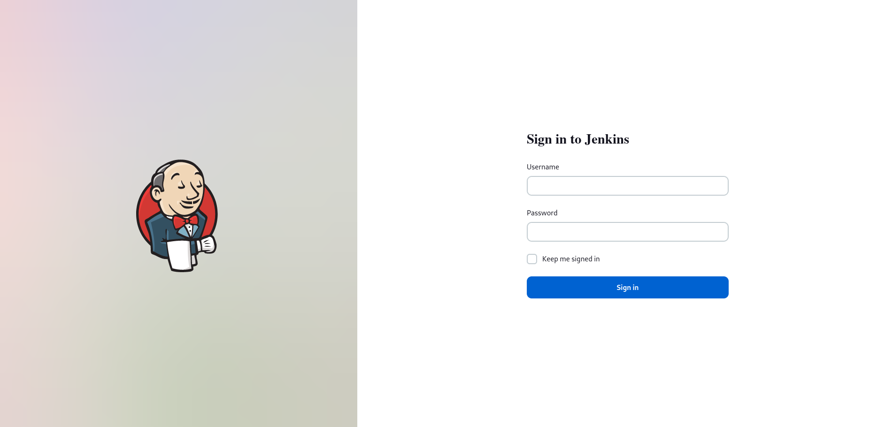

# Marvin project :desktop_computer:

## Done by Melissa - Epitech 2022 :mortar_board:

### Overview

This project is a part of the **second** year of Epitech.  
I had **2 weeks** to complete it. :spiral_calendar:  

The goal of this project was to discover Jenkins and its configuration files.  

### Running the project locally

From the repo:

- Clone this repostitory locally
- Run `docker compose up` in your bash / command line
- Once the containers have started, you can type on your favorite browser `localhost:8080`

> **Warning**
> Make sure docker is installed or it won't work.

An output you can get from this program can be:

Here are the different **tools** and **languages** I used to make this project: :hammer_and_wrench:

